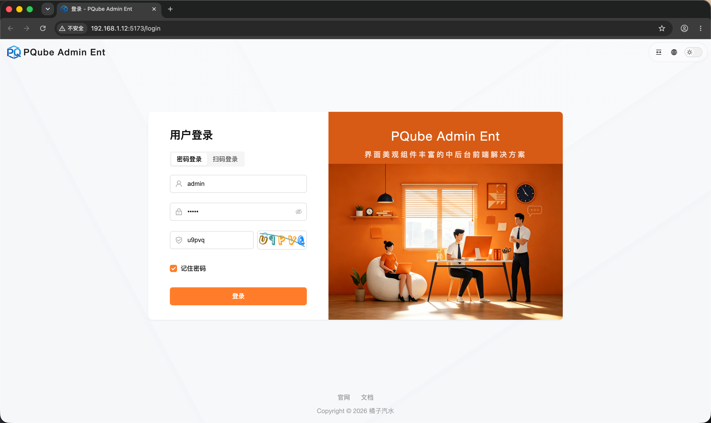
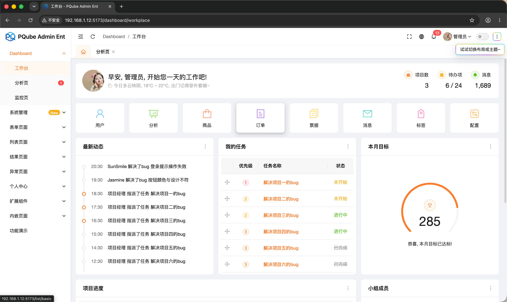
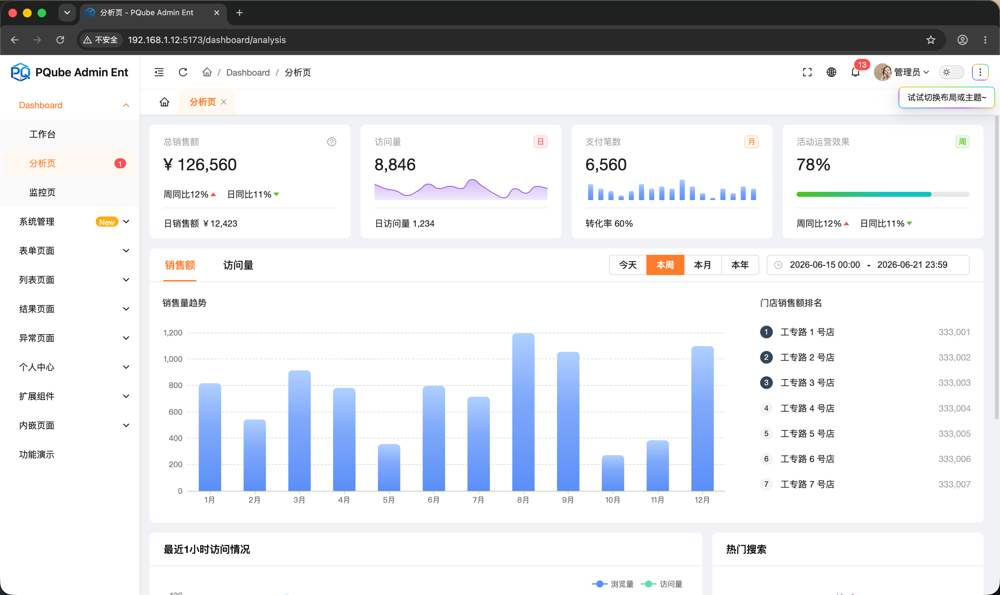
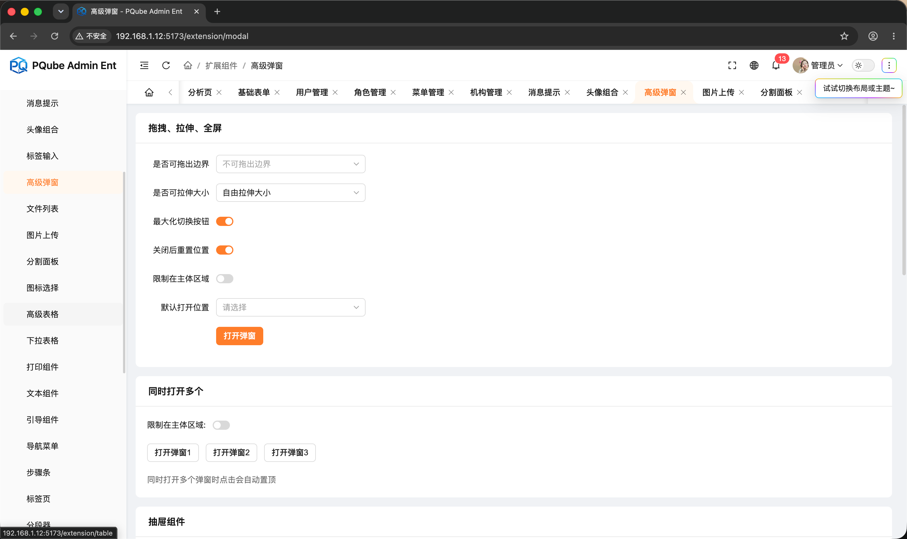
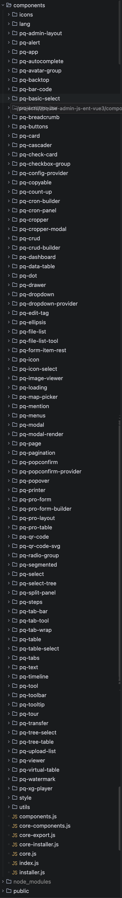

# pqube-admin-js-ent-vue3
> Vue3 + Vite6 纯 JavaScript 企业级中后台管理系统

## ⚠️ 重要须知
**不付费购买业务组件源码授权，无法使用完整功能，大量核心业务组件缺失，禁止商用**
1. 全套业务页面、高级封装组件、完整权限逻辑、多环境打包配置、配套飞书开发文档均为付费资源；
2. 未授权仅能浏览基础框架代码，本地运行会功能残缺，不能用于正式项目；
3. 企业系统开发、线上部署、二次商用分发必须购买授权，无授权使用属于侵权。

## 在线预览
| 首页 | 工作台 | 分析页面 ｜ 业务组件 ｜
|------|---------|---------|---------|
|  |  |  | |

## 业务组件列表
| 业务组件 | 
|------|
|  | 


## 组件源码与在线完整视频预览
[打开闲鱼购买](https://m.tb.cn/h.RNBsKAz?tk=xzxrg4gTPiICZ321 "点击打开闲鱼商品信息")
## 飞书开发文档（付费购买后可解锁查看权限）
[打开飞书文档](https://scn56l6fuews.feishu.cn/wiki/UbGiw1Ra2is4IvkCndoc3qb7nLc "点击打开飞书文档")

## 项目介绍
PQube Admin Ent JS 是 PQube Admin 系列面向中企业打造的无 Js 后台管理模板，基于 Vue3 + Vite6 + Element Plus 开发，全程使用原生 JavaScript，降低团队上手门槛。

框架内置全套企业后台常用能力：细粒度角色权限、多语言国际化、数据可视化图表、Excel 导入导出、富文本/Markdown 双编辑器、高德地图、拖拽排序、流媒体播放器、在线代码编辑器；配套完整工程化脚本，区分开发/测试/生产多环境打包，集成 ESLint + Prettier 代码规范，拿来即可快速开发 OA、商户后台、数据运营平台。

## 技术栈
### 核心框架
- Vue 3.5.22
- Vite 6.4.0
- Vue Router 4.6.3
- Pinia 3.0.3
- Element Plus 2.11.5
- Sass

### 请求 & 工具
- axios 1.12.2
- dayjs 1.11.18
- lodash-es 4.17.21
- @vueuse/core 13.9.0

### 数据可视化
- echarts 5.6.0
- vue-echarts 7.0.3
- echarts-wordcloud 2.1.0
- countup.js 2.9.0

### 文件/图片处理
- exceljs 4.4.0
- cropperjs 1.6.2
- jsbarcode 3.12.1

### 编辑器套件
- tinymce 5.10.9
- bytemd 1.22.0
- monaco-editor 0.47.0

### 多媒体
- xgplayer 3.0.23
- xgplayer-hls 3.0.23
- xgplayer-music 3.0.23

### 拓展交互
- sortablejs 1.15.6
- vuedraggable 4.1.0
- nprogress 0.2.0
- @amap/amap-jsapi-loader 1.0.1

### 工程化插件
- ESLint + Prettier 代码校验格式化
- unplugin-vue-components 组件自动按需引入
- vite-plugin-compression 生产 gzip 压缩

## 核心功能
1. **权限控制系统**
动态路由、角色权限、按钮级权限指令、路由拦截、菜单权限显隐控制
2. **国际化多语言**
vue-i18n 全局多语言切换，表单、弹窗、页面统一翻译管理
3. **全局主题定制**
支持自定义主题主色（橙色/藏蓝/浅灰等）、浅色/暗黑双模式
4. **通用业务组件**
高级搜索表单、分页表格、树形选择、上传、弹窗、抽屉、标签页等封装组件
5. **可视化图表**
折线、柱状、饼图、环形、仪表盘、词云等模板页面开箱即用
6. **文件操作**
Excel 批量导入导出、图片裁剪上传、条形码生成打印
7. **双编辑器**
TinyMCE 图文富文本 + ByteMD Markdown 代码高亮编辑器
8. **高德地图集成**
点位标记、地址检索、区域范围、轨迹绘制
9. **拖拽交互**
表格行拖拽、菜单排序拖拽、弹窗自由拖拽
10. **多媒体播放**
普通视频、HLS 流媒体、音频播放器，支持倍速、全屏
11. **在线代码编辑**
Monaco 编辑器，语法高亮、代码复制预览
12. **多环境打包**
开发环境 / 预发测试环境 / 生产环境三套独立构建配置

## 快速开始
### 安装依赖
```bash
pnpm install